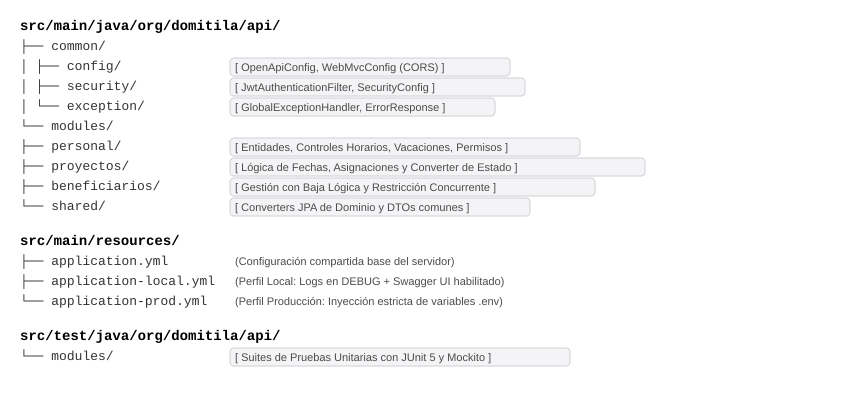
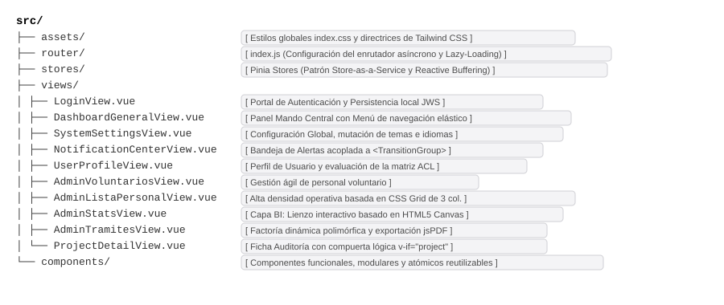

### Estructura del proyecto

* **Estructura del Servidor (Backend - Spring Boot):**

* **Estructura del Cliente (Frontend - Vue 3 Single Page Application):**

### Variables de entorno

#### Variables del Entorno Servidor (Backend)

| Variable | Descripción Técnica / Propósito en el Servidor |
| :--- | :--- |
| `DB_URL` | Ruta de conexión JDBC de MariaDB (ej: `jdbc:mariadb://localhost:3306/domitila_db`). |
| `DB_USER` | Nombre del usuario de la base de datos de desarrollo/producción. |
| `DB_PASSWORD` | Contraseña de acceso a la base de datos. |
| `JWT_SECRET` | Clave secreta simétrica de alta entropía para la firma y validación de tokens JWT. |
| `JWT_EXPIRATION_MS` | Tiempo de vida útil del token JWT en milisegundos. |
| `CORS_ALLOWED_ORIGINS` | Lista explícita de dominios frontend autorizados (`http://localhost:5173` en entorno dev). |

#### Variables del Entorno Cliente (Frontend)

| Variable | Descripción Técnica / Propósito en el Cliente |
| :--- | :--- |
| `VITE_API_BASE_URL` | URL base del punto de enlace (*endpoint*) de la API REST del backend (ej: `http://localhost:8080/api`). |

---

###  Dependencias principales

#### Librerías del Servidor Backend (`pom.xml`)
* `org.springframework.boot:spring-boot-starter-security`: Starter para la autenticación y control de accesos basados en roles (RBAC).
* `org.mariadb.jdbc:mariadb-java-client`: Conector de base de datos oficial para la comunicación con MariaDB 12.3.
* `io.jsonwebtoken:jjwt`: Biblioteca para la generación, firma y validación de tokens JWT *stateless*.
* `org.springdoc:springdoc-openapi-starter-webmvc-ui`: Generador de documentación interactiva expuesta en `/swagger-ui.html`.
* `org.springframework.boot:spring-boot-starter-test` / `org.mockito:mockito-core`: Framework de pruebas unitarias e integración para la ejecución de suites de test aisladas mediante `@ExtendWith(MockitoExtension.class)`.

#### Dependencias del Cliente Frontend (`package.json`)
* `vue (3.x)`: Framework *core* progresivo y reactivo basado en Composition API (`<script setup>`) para la construcción de la SPA.
* `vue-router (4.x)`: Enrutador oficial para Single Page Application, encargado del mapeo de URLs virtuales, evaluación de roles y navegación asíncrona.
* `pinia`: Almacén de estado centralizado oficial (`authStore`, `notificacionesStore`, `counterStore`), encargado de gestionar la sesión, caché y sincronización local.
* `axios`: Cliente HTTP basado en promesas utilizado en `apiClient.js` para peticiones REST, manejo de interceptores y cabeceras Bearer JWT.
* `tailwindcss`: Framework CSS utilitario encargado de proveer el diseño adaptativo (*Mobile-First*) con punto de ruptura (*breakpoint*) móvil en 900px.
* `chart.js` / `vue-chartjs`: Librería de renderizado de gráficos estadísticos e interactivos sobre elementos Canvas (`AdminStatsView.vue`).
* `jspdf`: Motor de compilación vectorial en el cliente utilizado para la generación y exportación de documentos en formato PDF de forma local.
* `vite-plugin-pwa`: Plugin encadenado a Vite encargado de la generación automática del Service Worker (Workbox) y compilación del manifiesto PWA para soporte offline e instalabilidad.