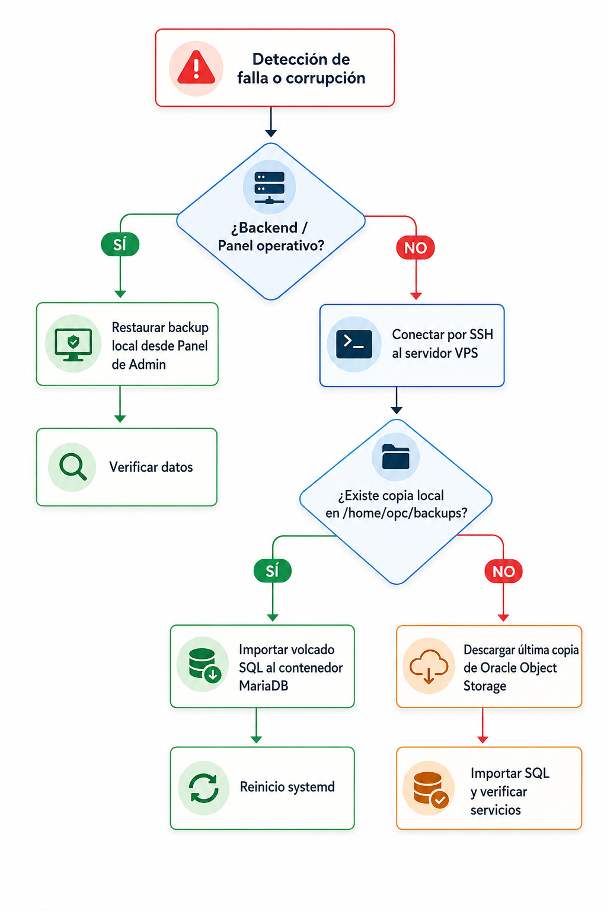

---

### Escenario A: Caída Crítica de la Infraestructura VPS o Contenedores

##### 1. Recuperación Automática
* **Base de Datos:** El contenedor MariaDB cuenta con la política `--restart unless-stopped`, levantándose automáticamente tras un reinicio del sistema.
* **Backend:** Configurado como servicio `systemd` para su reinicio automático ante caídas de proceso.
* **Red Interna:** La comunicación Backend-MariaDB se realiza mediante `127.0.0.1:3307`, garantizando estabilidad aunque Docker reasigne IPs internas al contenedor.

##### 2. Acción Correctora y Mejora
* Reservar y asociar una **IP Pública Estática (*Reserved IP*)** en OCI para sustituir la IP efímera actual, evitando reconfiguraciones de DNS tras un reinicio completo de la instancia.

---

### Escenario B: Corrupción Crítica de la Base de Datos

#### 1. Restauración desde Panel
Utilizar la función integrada de restauración en el panel de administración si el backend se encuentra operativo.

#### 2. Restauración Manual / Emergencia
* Si la copia local (`/home/opc/backups`) está dañada, descargar la última copia limpia desde Oracle Object Storage (`domitila-backups`).
* Importar el volcado SQL en el contenedor MariaDB 12.

#### 3. Mantenimiento Preventivo
Realizar simulacros periódicos de restauración en un entorno de pruebas (*staging*) para validar la integridad de los archivos `.sql`.

---

### Escenario C: Ciberataque o Brecha de Seguridad Perimetral

#### 1. Contención
* **Cierre inmediato** de puertos no esenciales en la *Security List* de la VCN en Oracle Cloud.
* **Aislamiento del tráfico no cifrado** (el sistema opera forzosamente bajo HTTPS con Let's Encrypt).

#### 2. Sanidad de Datos y Mitigación
* Si existió alteración malintencionada de datos, restaurar el último punto de respaldo verificado desde el bucket remoto aislado.

#### 3. Refuerzo Post-Incidente
* **Rotación inmediata** de todas las credenciales sensibles (claves de BD, tokens de producción, claves SSH).
* **Reemplazo del usuario administrador (`root`)** en las conexiones de la aplicación por un usuario de MariaDB con permisos mínimos necesarios (principio de menor privilegio).